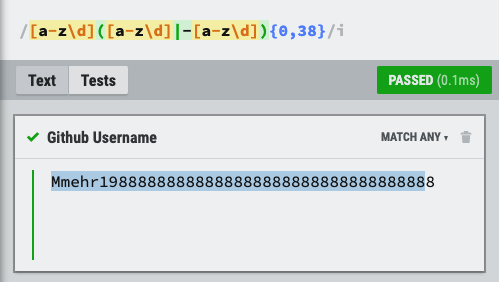

# psychic-pancake

## Regular Expression: Github Username

#

## Table of Contents

1. [Summary](#1-summary)
2. [Regex Basic Terminology](#2-regex-basic-terminology)

3. [Regex Components](#3-regex-components)

   3.1 [Anchors](#31-anchors)

   3.2 [Quantifiers](#32-quantifiers)

   3.3 [Grouping Constructs](#33-grouping-constructs)

   3.4 [Bracket Expressions](#34-bracket-expressions)

   3.5 [Character Classes](#35-character-classes)

   3.6 [The OR Operator](#36-the-or-operator)

   3.7 [Flags](#37-flags)

4. [Github Username Regex Explanation](#4-github-username-regex-explanation)
   4.1 [Regex Pattern](#41-regex-pattern)

   4.2 [Regex Pattern Rules](#42-regex-pattern-rules)

#

## 1. Summary

During the tenth week of my bootcamp, I was tasked with building a command line app that generated a team profile based on user input. The user would be prompted with a few questions to answer on each employee, and the final output would be in the form of an HTML webpage that displayed summaries for each team member.

The team was limited to three types of employees: manager, engineer and an intern. If the employee was an engineer, the user would have to provide the engineers Github username. It was my task to create a validation function to replicate the same functionality that would be expected from Github.

At the time of writing the code for the app, I decided on using the if-else polymorphism technique to check for invalid submissions. However, this took 14 lines of code.

```md
const gitCheck = (value) => {
if (value.length === 0) {
return 'Answer cannot be empty.';
} else if (value.indexOf(' ') >= 0) {
return 'Please delete the empty space in your answer';
} else if (value.indexOf('--') >= 0) {
return 'Cannot use consecutive hyphens in username';
} else if (value.substring(0, 1) === '-') {
return 'Cannot start with a hyphen';
} else if (value.length > 39) {
return 'Username cannot be longer than 39 characters.';
} else {
return true;
}
};
```

For this reason, I've decided to create a tutorial to explain the regex pattern that would provide the same result in less lines of code.

If you're interest in the app, please check the below link.

- Team Profile Generator Github Repo [link](https://github.com/mmehr1988/super-octo-bassoon)

While researching on how to write the regular expression for this tutorial, I came across an npm package that utilizes regular expressions for this very exact purpose. For more information, please check out the below link.

- Github Username Regex npm package [link](https://github.com/mmehr1988/super-octo-bassoon)

#

## 2. Regex Basic Terminology

Before jumping into the explanation of each component, I'd like to take the time to review some of the terminalogy that will be used in this tutorial.

| Term         | Definition                                                                               |
| ------------ | ---------------------------------------------------------------------------------------- |
| pattern      | A regular expression pattern is a sequence of characters that specifies a search pattern |
| string       | Text that is used to match the pattern                                                   |
| digit        | Numbers from 0-9                                                                         |
| letter       | The alphabet a-z or A-Z.                                                                 |
| symbol       | ! $ % ^ & \* ( ) \_ + \| ~ - = ` { } [ ] : ” ; ' < > ? , . /                             |
| space        | Spaces, tabs, line breaks                                                                |
| character    | A character is a letter, a digit, or symbol                                              |
| alphanumeric | A character that is either a letter or digit                                             |

#

## 3. Regex Components

Regular expression components are characters used to build the pattern. Each character represents a specific function. In general, there are a total of eight components and we will be discussing how each have been used to build the Github Username Regex pattern.

### 3.1 Anchors

Anchors are used for position matching within a string. Typical use is for when you want to match either the beginning or the end of a string. See below summary.

| Symbol | Definition                                                                    |
| :----: | ----------------------------------------------------------------------------- |
|   ^    | The caret symbol is used for when you want to match the beginning of a string |
|   $    | The dollar symbol is used for when you want to match the end of a string      |

### 3.2 Quantifiers

Quantifiers are used for when you want to specify the number times a specific character, group, or character class should be matched within a string.

| Symbol    | Definition                   |
| --------- | ---------------------------- |
| \*        | To match zero or more times. |
| +         | To match one or more times.  |
| ?         | To match zero or one time    |
| { n }     | To match exactly n times     |
| { n , }   | To match at least n times    |
| { n , m } | To match from n to m times   |

### 3.3 Grouping Constructs

Grouping is used for when you want to apply a pattern to the substrings of an input string. As an example, "blue car" is a substring of "the blue car". To achieve this, you would use round brackets.

| Symbol | Definition                                                  |
| :----: | ----------------------------------------------------------- |
|  ( )   | Round brackets are used for when you want to create a group |

### 3.4 Bracket Expressions

A bracket expression is when you take a list of characters and place them between square brackets. The list of characters between the brackets is called a "set".

The main types of bracket expressions are either positive or negatve bracket expressions.

- Positive: When you want to match any character in the set.

- Negative: When you want to match any character not in the set.

To specify a negative expression, you simply use a caret symbol "^" at the beginning of the set.

| Symbol | Definition      | Definition                                                |
| ------ | --------------- | --------------------------------------------------------- |
| []     | Square Brackets | Square brackets are used to initiate a bracket expression |
| 123    | Character Set   | An example character set                                  |
| [123]  | Positive        | Match the digit "1" or "2" or "3"                         |
| [^123] | Negative        | Match any digit other than "1" or "2" or "3"              |

### 3.5 Character Classes

A character class is the type of character specified in the set. The character class for [123] is digits.

The below table illustrates the main types of character classes.

| Types           | Pattern       | Equivalent To | Definition                                            |
| --------------- | ------------- | :-----------: | ----------------------------------------------------- |
| Range           | [a-e]         |       -       | Match any lower case letter from "a" to "e"           |
| digit           | [0-9]         |      /d       | Matches any digit character                           |
| not digit       | [^0-9]        |      /D       | Matches any none digit character                      |
| white space     | [ \t\r\n\f]   |      /s       | Matches any white space                               |
| not white space | [^ \t\r\n\f]  |      /S       | Matches any none white space                          |
| word            | [A-Za-z0-9_]  |      /w       | Matches any alphanumeric & underscore characters      |
| not word        | [^a-za-z0-9_] |      /W       | Matches any none alphanumeric & underscore characters |

The important takeway here is the "Equivalent To" column. Think of it as shortcuts or shorthands as their known.

I'll leave it for you to decide whether it's easier to remember "/s" or "[ \t\r\n\f]" for when you want to match white spaces.

### 3.6 The OR Operator

In regular javascript, we can define "OR" by using a vertical line character "|" or "pipe character" simultaneously one after another. In regex terms, to acheive the "OR" operator, you only need to use the vertical line once.

In simple terms, the "OR" operator allows you to match characters on either side of the vertical line.

### 3.7 Flags

Regular expressions can be broken down into two sections. The first section is the pattern and the second are the optional flags.

```
/patern/flags
```

It's important to keep in mind that flags are optional and are not mandatory. The reason for the optionality is that flags change the behaviour of a regex pattern.

As an example, let's use "The sky is blue" as the input string.

#### No Flags

<pre>
/[a-z]/ => T<mark>h</mark>e sky is blue
</pre>

- In the current regex pattern will look for the first lower case letter in the input string.

#### Global Flag or "g"

<pre>
/[a-z]/g => T<mark>he</mark> <mark>sky</mark> <mark>is</mark> <mark>blue</mark>
</pre>

- By placing a "g" at the end of the expression, we're telling the regex engine to match all the lower case letters in the input string. However, the upper case "T" is still unmatched.

#### Case Insensitivity Flag or "i"

<pre>
/[a-z]/gi => <mark>The</mark> <mark>sky</mark> <mark>is</mark> <mark>blue</mark>
</pre>

- To correctly capture all the letters in our input string - ignoring upper case and lower case letters - we can place a second flag to ignore distinction made between upper case and lower case letters. We can achieve this by placing an "i" after the "g".

In summary, what we've done is we've modifed the initial character class range [a-z] which accounts only for lower case letters to match all lower case and upper case letters in the input string.

To achieve the same result without the "i" flag, we could have expanded the set to include the upper case letters by simply add [A-Z]. See below

<pre>
/[a-zA-Z]/g => <mark>The</mark> <mark>sky</mark> <mark>is</mark> <mark>blue</mark>
</pre>

#

## 4. Github Username Regex Explanation

Now that we have a understanding of the most important concept used in building regular expressions, let's break down "Github Username Regex".

### 4.2 Regex Pattern Rules

When attempting to creating a regular expression, it's always important to first create a set of rules that the pattern must follow. See below list for Github Username Rules.

1. Ignores case sensitivity
1. Start with alphanumeric characters
1. Succeeding character can only include alphenumeric or hyphen and then alphenumeric
1. Cannot use double hyphen "--"
1. End with alphanumeric characters
1. Max character length = 39

### 4.3 Regex Pattern Username Tests

| Username    | Pass or Fail |
| ----------- | ------------ |
| mmehr1988   | Pass         |
| Mmehr1988   | Pass         |
| mmehr-1988  | Pass         |
| mmehr--1988 | Fail         |
| -mmehr1988  | Fail         |
| \_mmehr1988 | Fail         |
| mmehr_1988  | Fail         |
| mmehr@1988  | Fail         |

### 4.4 Regex Pattern Build

Now that we've established the rules we can begin writing the actual expression. Let's work through each rule as a separate section.

The username we will test the regular expression against will be: Mmehr1988

### 4.4.1 Ignores case sensitivity

Based on section [3.7 Flags](#37-flags), to ignore case sensitivity, we can simply use the "i" flag. Therefore, as a starting point, let's just get that out of the way so we can focus on the actual pattern.

```
/ /i
```

### 4.4.2 Start with alphanumeric characters

Our second rule states that the username must begin with an alphanumeric character. This both digits and letters are acceptable.

To do this, we will need to create set that ranges across all letters and digits. Based on section [Character Classes](#35-character-classes), for the letters we can state [a-z] and for digits we can write [0-9]. Combining the 2, we would get [a-z0-9].

Let's now substitute the [0-9] for the shorthand version which will make the set a little cleaner.

<pre>
/[a-z\d]/i => <mark>M</mark>mehr1988
</pre>

### 4.4.2 Succeeding Characters

Our third rule states that the succeeding username character must either be alphanumeric OR a hyphen and then alphanumeric. See below.

- letters
- digits
- -letters
- -digit

To achieve this, we will have to take advantage of the [Grouping Constructs](#33-grouping-constructs) and [The OR Operator](#36-the-or-operator). As a reminder, to write the OR logical we will need to use the vertical line symbol "|".

Step #1: Create The Group Construct For OR Logic

<pre>
/[a-z\d]<mark>()</mark>/i => <mark>M</mark>mehr1988
</pre>

Step #2: Create The First Expression in the OR logic

- letters
- digits

<pre>
/[a-z\d](<mark>[a-z\d]</mark>)/i => <mark>Mm</mark>ehr1988
</pre>

Step #3: Create The Second Expression in the OR logic

- -letters
- -digit

<pre>
/[a-z\d](<mark>[a-z\d]|-[a-z\d]</mark>)/i => <mark>Mm</mark>ehr1988
</pre>

With the folloiwng pattern we've also account for Rule #4 & Rule #5 which states "no double hyphens allowed" and the username must end with alphanumeric character.

### 4.4.2 Apply OR logical to the remaining characters

We need to now figure out how to apply the OR logic across all the succeeding characters. To do this final step, we will have to use quantifiers.

In [3.2 Quantifiers](#32-quantifiers), quantifiers are used for when you want to specify the number times a specific character, group, or character class should be matched within a string.

Therefore, for our purposes, to apply the OR logic across the remaining characters we will need to use the quantifier { n , m }. The reason for this is related to Rule #6 which states that the maximum number of character for any username cannot exceed 39 characters. If it does, the username test must fail.

Given that we've already accounted for the first character in the username, the remaining character count must be between 0 to 38 characters.

To achieve this criteria, we simply write {0,38} after OR logic.

<pre>
/[a-z\d]([a-z\d]|-[a-z\d])<mark>{0,38}</mark>/i => <mark>Mmehr1988</mark>
</pre>

It might seem that we are done, but there is still a couple of things we need to account for.

As of right now, if we had a username that was 40 characters long, but the first 39 characters matched, we would still receive a pass, when in reality the test should fail.



The reason for this is that we haven't established a start or an end to where the regex pattern should be applied. Once we do, the regex engine will automatically understand that the start and end of the username must be a maximum of 39 characters long.


### 4.1 Regex Pattern

```
/^[a-z\d](?:[a-z\d]|-(?=[a-z\d])){0,38}$/i
```
