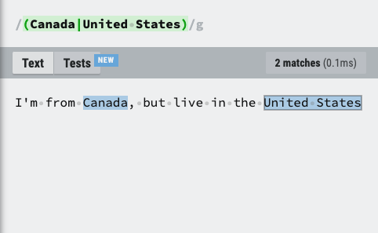
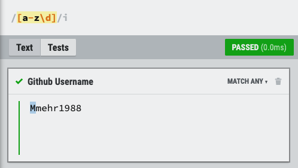
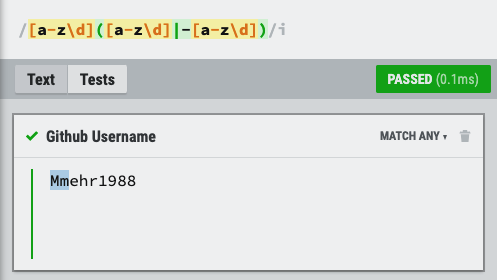
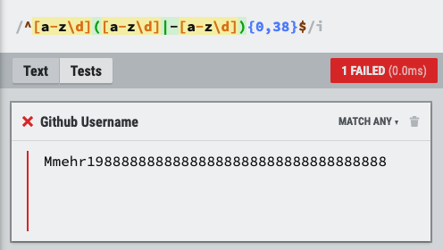

# psychic-pancake

## Regular Expression Tutorial: Github Username

#

## Table of Contents

1. [Summary](#1-summary)
2. [Regex Basic Terminology](#2-regex-basic-terminology)

3. [Regex Components](#3-regex-components)

   3.1 [Anchors](#31-anchors)

   3.2 [Quantifiers](#32-quantifiers)

   3.3 [Grouping Constructs](#33-grouping-constructs)

   3.4 [Bracket Expressions](#34-bracket-expressions)

   3.5 [Character Classes](#35-character-classes)

   3.6 [The OR Operator](#36-the-or-operator)

   3.7 [Flags](#37-flags)

   3.8 [Character Escapes](#38-character-escapes)

4. [Github Username Regex Explanation](#4-github-username-regex-explanation)

   4.1 [Regex Pattern](#41-regex-pattern)

   4.2 [Regex Pattern Rules](#42-regex-pattern-rules)

   4.3 [Regex Pattern Build](#43-regex-pattern-build)

   4.4 [Final Regex Pattern](#44-final-regex-pattern)

5. [Online Resources For Learning](#5-online-resources-for-learning)

#

## 1. Summary

In this tutorial, you will learn about what a regular expression (regex or regexp) is, a brief overview of the major concepts, and a walkthrough of a real life example.

By definition,

> "Regular expressions are patterns used to match character combinations in strings. A regular expression pattern is composed of simple characters, such as /abc/, or a combination of simple and special characters."

MDN Web Docs: [Regular Expressions](https://developer.mozilla.org/en-US/docs/Web/JavaScript/Guide/Regular_Expressions)

It might seem surprising, but the initial purpose of regular expressions was not meant for computers. Instead, the idea was developed to explain the nervous system and it wasn't until 1956 that a scientist by the name Stephen Kleene adapted the concept to the model we know it be today.

In the world of web development, regular expressions are used for matching and validation purposes. A perfect example is when you want to create a password for logging into a website. Regular expressions can be used to check whether the password you've entered meets the complexity requirements the website has set - "Your password needs to be at least 8 characters long".

### What & Why?

During the tenth week of my bootcamp, I was tasked with building a command line app that generated a team profile based on user input. One of the questions used to generate a team members profile was to provide a valid Github username. It was my task to create a validation function to replicate the same functionality that would be expected from Github.

At the time of writing the code for this app, I decided on using the if-else polymorphism technique to check for invalid submissions. However, this took 14 lines of code.

```md
const gitCheck = (value) => {
if (value.length === 0) {
return 'Answer cannot be empty.';
} else if (value.indexOf(' ') >= 0) {
return 'Please delete the empty space in your answer';
} else if (value.indexOf('--') >= 0) {
return 'Cannot use consecutive hyphens in username';
} else if (value.substring(0, 1) === '-') {
return 'Cannot start with a hyphen';
} else if (value.length > 39) {
return 'Username cannot be longer than 39 characters.';
} else {
return true;
}
};
```

For this reason, I decided to create a tutorial to explain the regex pattern that would provide the same result in less lines of code.

If you're interest in the app, please check the below link.

- Team Profile Generator Github Repo [link](https://github.com/mmehr1988/super-octo-bassoon)

It should be noted that the regular expression used in this tutorial was not written by me, but rather from an npm package. For more information, please check out the following [link](https://www.npmjs.com/package/github-username-regex).

#

## 2. Regex Basic Terminology

The below is a table that summarizes some of the terminology used throughout this tutorial.

| Term         | Definition                                                   |
| ------------ | ------------------------------------------------------------ | --- |
| Regex        | Patterns used to match character combinations in strings     |
| Input String | Text that is used to match the pattern                       |
| Digits       | Numbers from 0-9                                             | \   |
| Pattern      | A sequence of characters that specifies a search pattern     | \   |
| Letters      | The alphabet a-z or A-Z.                                     |
| Symbols      | ! $ % ^ & \* ( ) \_ + \| ~ - = ` { } [ ] : ” ; ' < > ? , . / |
| White Space  | Spaces, tabs, line breaks                                    |
| Character    | A character is a letter, a digit, or symbol                  |
| Alphanumeric | A character that is either a letter or digit                 |

#

## 3. Regex Components

Regex components are characters used to build the pattern to test an input string for matching or validation purposes. In general, there are a total of eight components, and we will be discussing each one.

### 3.1 Anchors

Anchors are used for position matching within a string. Typical use is for when you want to match either the beginning or the end of a string. See below summary.

| Symbol | Definition                                                                    |
| :----: | ----------------------------------------------------------------------------- |
|   ^    | The caret symbol is used for when you want to match the beginning of a string |
|   $    | The dollar symbol is used for when you want to match the end of a string      |

### 3.2 Quantifiers

Quantifiers are used for when you want to specify the number times a specific character, [group](#33-grouping-constructs), or [character classes](#35-character-classes) should be matched within a string.

| Symbol    | Definition                   |
| --------- | ---------------------------- |
| \*        | To match zero or more times. |
| +         | To match one or more times.  |
| ?         | To match zero or one time    |
| { n }     | To match exactly n times     |
| { n , }   | To match at least n times    |
| { n , m } | To match from n to m times   |

### 3.3 Grouping Constructs

Grouping is used for when you want to apply a pattern to the substrings of an input string. As an example, "blue car" is a substring of "the blue car". To achieve this, you would use round brackets.

| Symbol | Definition                                                  |
| :----: | ----------------------------------------------------------- |
|  ( )   | Round brackets are used for when you want to create a group |

### 3.4 Bracket Expressions

A bracket expression is when you take a list of characters and place them between square brackets. The list of characters between the brackets is called a "set".

For simplicity, the two main types are positive or negatve bracket expressions.

- Positive: When you want to match any character in the set.

- Negative: When you want to match any character not in the set.

To specify a negative expression, you simply use a caret symbol "^" at the beginning of the set.

| Symbol | Definition      | Definition                                                |
| ------ | --------------- | --------------------------------------------------------- |
| []     | Square Brackets | Square brackets are used to initiate a bracket expression |
| 123    | Character Set   | An example character set                                  |
| [123]  | Positive        | Match the digit "1" or "2" or "3"                         |
| [^123] | Negative        | Match any digit other than "1" or "2" or "3"              |

### 3.5 Character Classes

A character class is the type of character specified in the set. As an example, the character class for [123] is digits.

The below table illustrates the main types of character classes.

| Character Class | Pattern       | Equivalent To | Definition                                            |
| --------------- | ------------- | :-----------: | ----------------------------------------------------- |
| range           | [a-e]         |       -       | Match any lower case letter from "a" to "e"           |
| dot             | .             |    [^\n\r]    | Match any character except line breaks.               |
| digit           | [0-9]         |      /d       | Matches any digit character                           |
| not digit       | [^0-9]        |      /D       | Matches any none digit character                      |
| white space     | [ \t\r\n\f]   |      /s       | Matches any white space                               |
| not white space | [^ \t\r\n\f]  |      /S       | Matches any none white space                          |
| word            | [A-Za-z0-9_]  |      /w       | Matches any alphanumeric & underscore characters      |
| not word        | [^a-za-z0-9_] |      /W       | Matches any none alphanumeric & underscore characters |

### 3.6 The OR Operator

In regular javascript, we can define "OR" by using a vertical line character "|" or "pipe character" simultaneously one after another. In regex terms, to acheive the "OR" operator, you only need to use the vertical line once.

In simple terms, the "OR" operator allows you to match characters on either side of the vertical line.



### 3.7 Flags

Regular expressions can be broken down into two sections. The first section is the pattern and the second are the optional flags.

```
/patern/flags
```

It's important to keep in mind that flags are optional and are not mandatory. The reason for the optionality is that flags change the behaviour of a regex pattern.

To fully understand flags, lets run through a quick example and use "Why is the sky blue?" as the input string. The goal is to write a regex pattern that will match all the letters excluding the question mark at the end.

#### No Flags

- [a-z] - Character class range for letters "a" to "z".


- In section [Character Classes](#35-character-classes), we discussed that wrapping characters inside square brackets would match all the characters inside the bracket. In theory, one would think that the above pattern would work, but it's not that simple. This is where flags come to our help.

#### Global Flag or "g"


- By placing a "g" at the end of the expression, we're telling the regex engine to match all the lower case letters in the input string. However, the upper case "W" is still unmatched.

#### Case Insensitivity Flag or "i"


- To correctly capture all the letters in our input string - ignoring upper case and lower case letters - we can place a second flag to ignore distinction made between upper case and lower case letters. We can achieve this by placing an "i" after the "g".

In summary, what we've done is we've modifed the initial character class range [a-z] which accounts only for lower case letters to match all lower case and upper case letters in the input string.

To achieve the same result without the "i" flag, we could have expanded the set to include the upper case letters by simply adding [A-Z]. See below


### 3.8 Character Escapes

The last regex component to understand before we begin writing our Github Regex Username Pattern is "Character Escapes".

The best way to explain this is concept is yet again through an example.

Let's say you're building a website and you want to give the user the ability to upload images. To make sure users only upload images, you want to write a regex pattern that only accepts `.png` files.

For the first attempt, your pattern might look something like the below.

```
/.png/g
```

#### Scenerio #1: Filename = profile.png


In scenerio #1, with the filename `profile.png`, the input value has passed.

Now lets assume, the user accidently deletes the "." and uploads `profilepng`.

In this case, we would expect a fail, but check out the below image. The file name passed the test when it should have failed.

Why do you think that is?

#### Scenerio #2: Filename: profilepng


The reason why the filename passed when it should have failed is due the character class "dot" which was described in section [3.5 Character Classes](#35-character-classes). The "dot" is used to "match any character except line breaks".

So when we write `/.png/g`, we are stating that the regex engine should return passed when the input string has "any character" and "png" written.

So in our scenerio, "`epng` was passed, when it should have failed.

In order to specify that we only want `.png` to show a passing result, we need to "character escape" the "dot" character class.

To do this, place the character escape symbol "forward slash" or "\" infront of the dot.

```
/\.png/g
```

As you can see with the below image, the correct file matched while the incorrect file did not.


## 4. Github Username Regex Explanation

Now that we have an understanding of the most important concept used in building regular expressions, let's break down "Github Username Regex Pattern".

### 4.1 Regex Pattern Rules

When attempting to creating a regular expression, it's always important to first create a set of rules that the pattern must follow. See below list for Github Username Rules.

1. Ignores case sensitivity
1. Start with alphanumeric character
1. Succeeding characters can only include alphenumeric or hyphen and then alphenumeric
1. Succeeding characters cannot use double hyphen "--"
1. Username must with alphanumeric character
1. Max character length = 39

### 4.2 Regex Pattern Username Tests

| Username    | Pass or Fail |
| ----------- | ------------ |
| mmehr1988   | Pass         |
| Mmehr1988   | Pass         |
| mmehr-1988  | Pass         |
| mmehr--1988 | Fail         |
| -mmehr1988  | Fail         |
| \_mmehr1988 | Fail         |
| mmehr_1988  | Fail         |
| mmehr@1988  | Fail         |

### 4.3 Regex Pattern Build

Now that we've established the rules we can begin writing the pattern.

```
Tutorial Username: Mmehr1988
```

### 4.3.1 Ignore Case Sensitivity

Based on section [3.7 Flags](#37-flags), to ignore case sensitivity, we can simply use the "i" flag. Therefore, as a starting point, let's just get that out of the way so we can focus on the actual pattern.

```
/ /i
```

### 4.3.2 Pattern Starts With Alphanumeric Characters

Our second rule states that the username must begin with an alphanumeric character. This means both digits and letters are acceptable.

To do this, we will need to create a character "set" that ranges across all letters and digits. Based on section [Character Classes](#35-character-classes), for the letters we can use [a-z] and for digits we can write [0-9]. Combining the 2, we would get [a-z0-9].

Let's now substitute the [0-9] for the shorthand version which will make the character set a little cleaner.



### 4.3.2 Account For Remaining Characters

Our third rule states that the succeeding username character must either be alphanumeric OR a hyphen and then alphanumeric. See below.

- letters
- digits
- -letters
- -digit

To achieve this, we will have to take advantage of the [3.3 Grouping Constructs](#33-grouping-constructs) and [3.6 The OR Operator](#36-the-or-operator). As a reminder, to write the OR logical we will need to use the vertical line symbol "|".

Step #1: Create The Group Construct For OR Logic

<pre>
/[a-z\d]<mark>()</mark>/i => <mark>M</mark>mehr1988
</pre>

Step #2: Create The First Expression in the OR logic

- letters
- digits


Step #3: Create The Second Expression in the OR logic

- -letters
- -digit



With the folloiwng pattern we've also accounted for Rule #4 & Rule #5 which states "no double hyphens allowed" and the username must end with alphanumeric character.

### 4.3.2 OR Logical

We need to now figure out how to apply the OR logic across all the remaining characters. To do this final step, we will have to use quantifiers.

Per section [3.2 Quantifiers](#32-quantifiers), quantifiers are used for when you want to specify the number times a specific character, group, or character class should be matched within a string.

The specific quantifier we need to use in our scenerio will be the `{ n , m }`. The reason for this is related to Rule #6 which states that the maximum number of character for any username cannot exceed 39 characters. If it does, the username test must fail.

Given that we've already accounted for the first character in the username, the remaining character count must be between 0 to 38 characters.

To achieve this criteria, we simply write {0,38} after OR logic.


It might seem that we are done, but there is still a couple of things we need to account for.

As of right now, if we had a username that was 40 characters long, but the first 39 characters matched, we would still receive a pass, when in reality the test should fail.


The reason for this is that we haven't established a start or an end to where the regex pattern should be applied. Once we do, the regex engine will automatically understand that the start and end of the username must be a maximum of 39 characters.

If the username entered is greater than 39 characters, then the test will fail.

Referring to section [3.1 Anchors](#31-anchors), we use the caret symbol to match the beginning of the string and the dollar symbol to match the end of the string.

By applying both anchors to our pattern we will have correctly created our Github Username Regex Expression.



### 4.4 Final Regex Pattern

```
/^[a-z\d]([a-z\d]|-([a-z\d])){0,38}$/i
```

## 5. Online Resources For Learning

- [regexr](https://regexr.com/): Helpful website to write and test regex patterns
- [Youtube Tutorial](https://www.youtube.com/watch?v=9RksQ5YT7FM&t=52s): There are thousands of videos on this topic, but for some reason this video just made the topic a little more fun. Plus, the kid is a great teacher.
- [Example Tutorial](https://coding-boot-camp.github.io/full-stack/computer-science/regex-tutorial): A great regex tutorial
- [Github Repo](https://github.com/ziishaned/learn-regex/blob/master/README.md): This a great github repo explaining all the major concepts.
